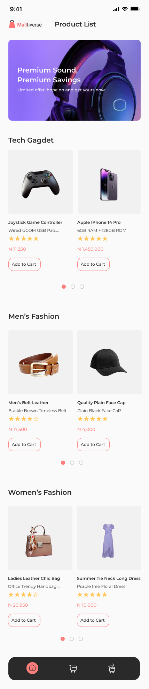
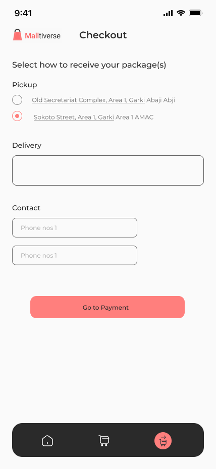

# 🛒 HNG Shop - Your Ultimate Shopping Companion!

Welcome to **HNG Shop**, a beautifully crafted shopping application built with React Native and Expo! Dive into a seamless shopping experience with an intuitive interface, modern design, and all the essential features you need for your shopping spree.

## 🌟 Features

- **Light & Modern UI**: Enjoy a clean and user-friendly interface with the Poppins font.
- **Effortless Navigation**: Navigate through the app with ease using the Expo Router.
- **Product Listings**: Browse through a variety of products fetched dynamically from the Timbu API.
- **Cart Management**: Add, update, and remove items from your cart with a few taps.
- **Responsive Design**: Optimized for both Android and iOS devices.

## 📱 Preview the App

### Appetize.io
Experience the app live without installation:
[Open HNG Shop on Appetize.io](https://appetize.io/app/b_n4fmdpkkeqt5mljeoezhxhnniq)

### Download the APK
Install the app directly on your Android device:
[Download HNG Shop APK](https://expo.dev/artifacts/eas/rJGffq4H6eh2HSJooeU4h5.apk)

## 📸 Screenshots

| Home Screen                           | Product Cart                      | CheckOut                          |
|---------------------------------------|--------------------------------------|--------------------------------------|
|   |  |   |

## 🚀 Getting Started

### Prerequisites

Ensure you have the following installed:

- Node.js
- Expo CLI
- Git

### Installation

1. **Clone the repository**:
   ```sh
   git clone https://github.com/CoderFaveX/hng-shop.git
   cd hng-shop
   ```

2. **Install dependencies**:
   ```sh
   npm install
   ```

3. **Start the Expo server**:
   ```sh
   npx expo start
   ```

4. **Run on your device**:
   - Use the Expo Go app on your phone to scan the QR code from the terminal or browser.